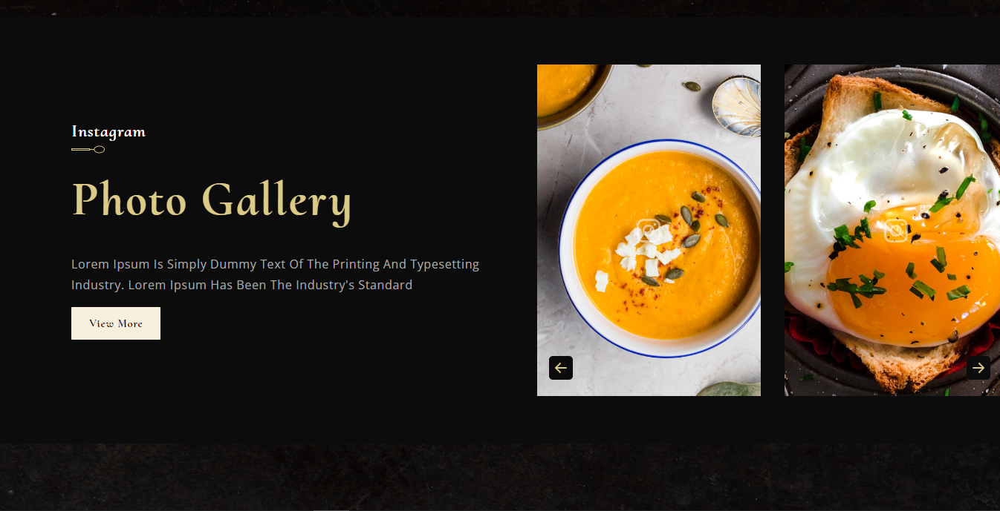
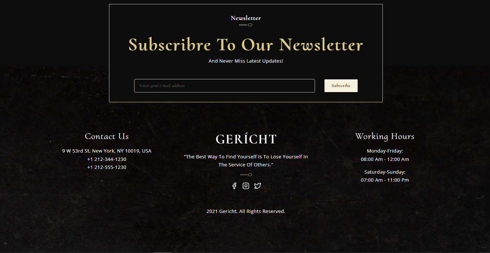
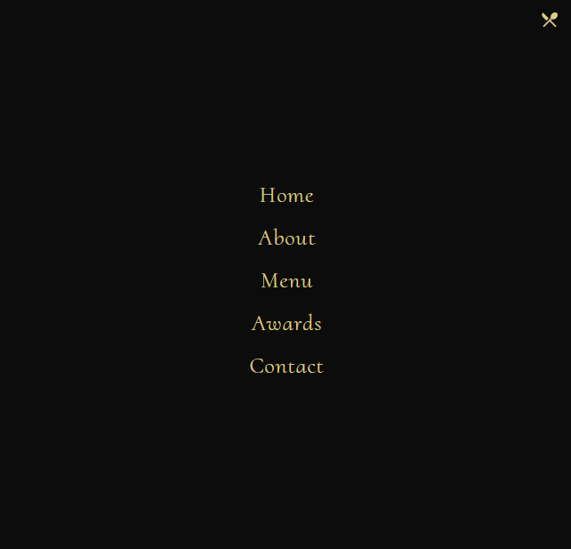

### Geritch Resturant

### :link: https://gericht.vercel.app/

### Learned from : [JavaScript Mastery](https://youtu.be/4oV65GVVits)

## Images

## Mobile Responsive

## Run Locally

- Run this command `git clone https://github.com/aliaftabsheikh/Geritch-Resturant.git`
- You are now in the dev environment and you can play around

## Tech Stack

- HTML5
- CSS3
- Javascript ES6
- React js
- Github

## How we Learn

- React Functional components and their reusability
- React file and folder structure
- Fundamental CSS properties to master flex & grid
- Fundamentals of the CSS BEM Model
- From soft and pleasant animations to complex gradients
- Perfectly placed media queries for satisfactory responsiveness covering almost devices
- And at the end you'll learn how to deploy your websites to extremely fast servers and give them a custom domain name.
