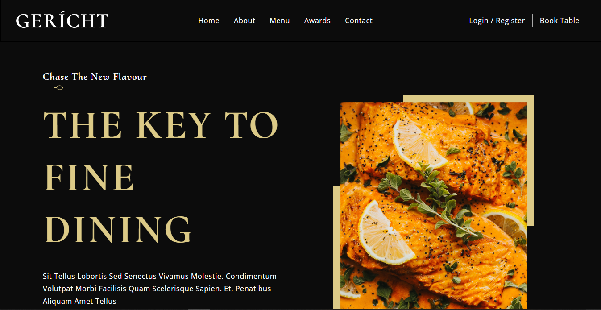
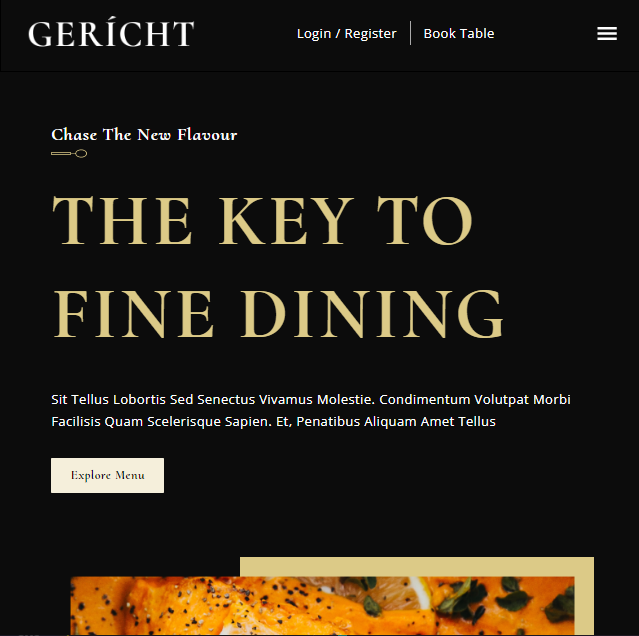

### Geritch Resturant

### :link: https://gericht.vercel.app/

### Learned from : [JavaScript Mastery](https://youtu.be/4oV65GVVits)

## Images

## Mobile Responsive

## Run Locally

- Run this command `git clone https://github.com/aliaftabsheikh/Geritch-Resturant.git`
- You are now in the dev environment and you can play around

## Tech Stack

- HTML5
- CSS3
- Javascript ES6
- React js
- Github
